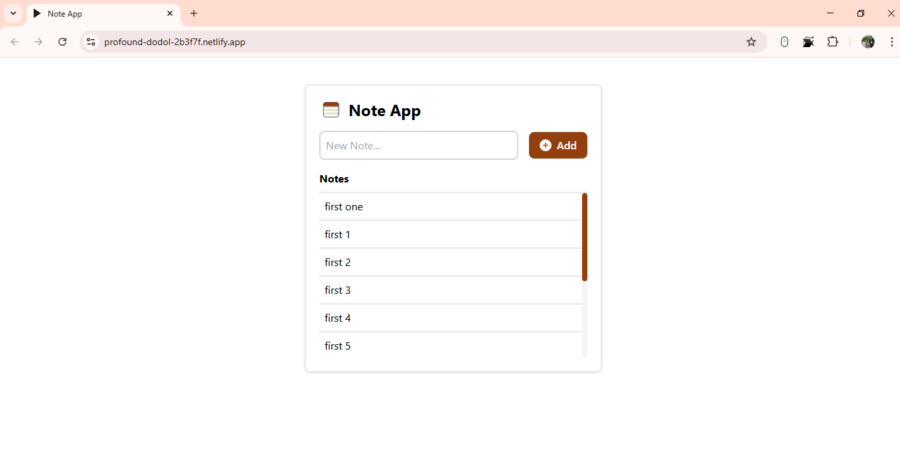

# 📝 Note App

A simple full-stack **Note-taking Application** built with **React + Vite** on the frontend and **Node.js + Express** on the backend.

---

## 🌐 Live Demo

- **Frontend (Netlify)**: [View App](https://profound-dodol-2b3f7f.netlify.app/)
- **Backend (Render)**: [API Server](https://fullstack-task-sandeep.onrender.com)

---

## 🖼️ Preview

  
> Replace `client/src/assets/preview.png` with the actual path to your preview image if different.

---

## 🚀 Features

- Add new notes easily
- Notes are stored and fetched from a live backend
- Clean and responsive UI with Tailwind CSS
- Loading spinners and disabled states for better UX
- Custom scrollbar styling
- Smooth deployment on Netlify (frontend) and Render (backend)

---

## 🛠 Tech Stack

- **Frontend**: React, TypeScript, Vite, Tailwind CSS, Axios
- **Backend**: Node.js, Express, MongoDB (via Mongoose)
- **Deployment**: Netlify (frontend), Render (backend)

---

## ⚙️ API Endpoints

| Method | Endpoint                         | Description          |
|:------:|----------------------------------|----------------------|
| GET    | `/api/todos`                     | Fetch all notes      |
| POST   | `/api/todos`                     | Add a new note       |

> **Note:**  
> API Base URL = `https://fullstack-task-sandeep.onrender.com/api/todos`

---

## 📦 Project Setup (Local Development)

### Frontend (Client)

```bash
# Go to client directory
cd client

# Install dependencies
npm install

# Run locally
npm run dev
```

> Make sure to set your `.env` file inside `client/`:
```env
VITE_API_URL=https://fullstack-task-sandeep.onrender.com/api/todos
```

---

### Backend (Server)

```bash
# Go to server directory
cd server

# Install dependencies
npm install

# Run server
npm run start
```

Server should be running on your chosen port (example: 8000).

---

## 📂 Folder Structure

```
client/    --> React frontend
server/    --> Node.js backend
```

---

## 👤 Author

**Sandeep Kumar**

- GitHub: [Sandykr29](https://github.com/Sandykr29)


---

## ⭐️ Show Your Support

If you like this project, give it a ⭐️ on GitHub!

---

# 🙌 Thank you!